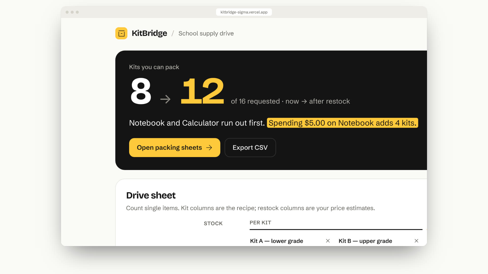
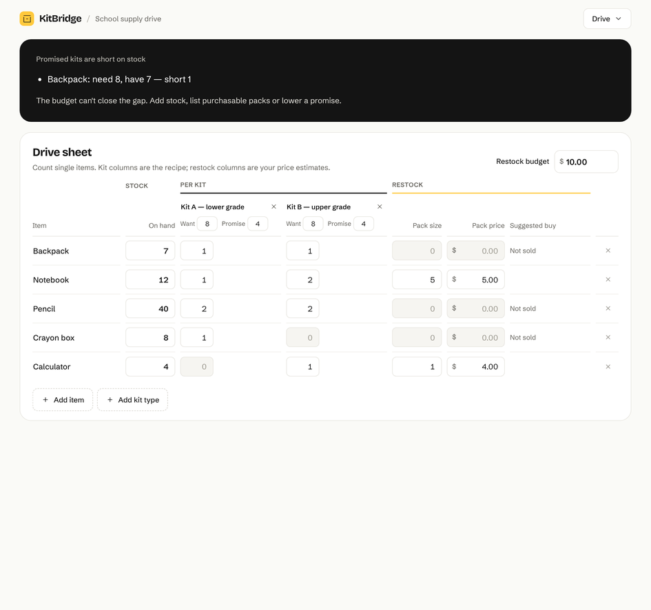
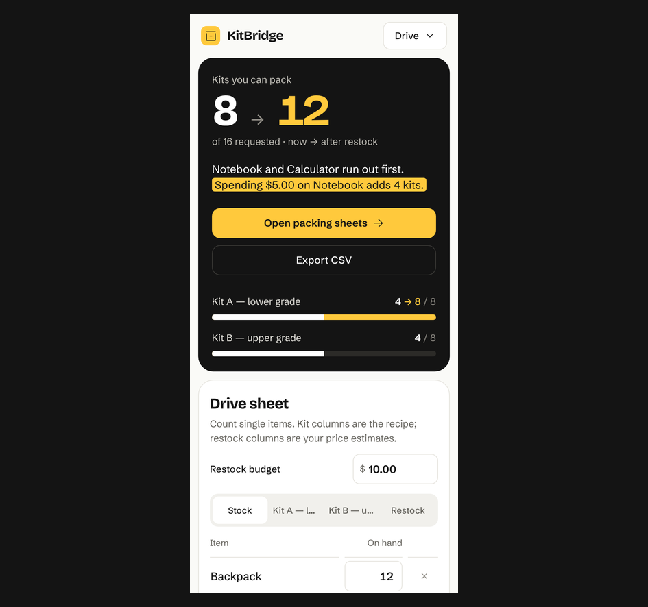
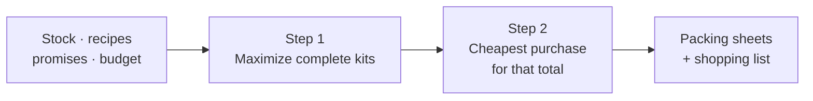

<h1 align="center">
  <br />
  KitBridge
</h1>

<p align="center"><strong>Turn mixed donations into complete school-supply kits.</strong><br />
Know how many kits you can pack right now, and what to buy next.</p>

<p align="center">
  <a href="https://kitbridge-sigma.vercel.app"></a>
  <a href="https://kitbridge-sigma.vercel.app/demo/"></a>
</p>

<p align="center">
  <a href="https://github.com/Yun-0000/KitBridge/actions/workflows/ci.yml"></a>
  <a href="LICENSE"></a>
  
  
</p>

<p align="center">
  <a href="https://kitbridge-sigma.vercel.app/demo/">
    
  </a>
  <br />
  <sub>▶ <a href="https://kitbridge-sigma.vercel.app/demo/">Watch the narrated demo</a> (1:55, captions on screen)</sub>
</p>

## The problem

A school supply drive can have plenty of donations and still run short of complete kits. One group needs crayons, another needs calculators, both need notebooks, and some kits were promised weeks ago. Counting by hand, it is hard to see what to pack, and which purchase actually finishes more kits.

## What KitBridge does

| 1 · Count | 2 · Plan | 3 · Pack |
| :--- | :--- | :--- |
| One drive sheet for stock on hand, the recipe for each kit and restock prices. | See kits now and after restock, what runs out first, and the one purchase that helps most. | Print a checklist for each kit type, or export CSV. |

The example drive packs **8 kits** from stock. One **$5 notebook pack** brings that to **12 of 16**. Change any number and the plan updates as you type.

<table>
  <tr>
    <td width="50%" valign="top"><br /><sub><b>The answer on top.</b> Kits now and after restock, and why.</sub></td>
    <td width="50%" valign="top"><br /><sub><b>Packing sheets.</b> Exact totals for each kit, ready to print.</sub></td>
  </tr>
  <tr>
    <td valign="top"><br /><sub><b>Promises are hard limits.</b> KitBridge names the shortage instead of breaking a promise.</sub></td>
    <td valign="top"><br /><sub><b>Works on a phone.</b> Count right in the stockroom.</sub></td>
  </tr>
</table>

## Made for supply drives

- **See the bottleneck.** The plan names the supply that runs out first and what the next kit still needs.
- **Keep commitments.** Set a minimum for each group and see shortages when stock falls short.
- **Spend only where it helps.** If a purchase does not finish another kit, KitBridge spends nothing.
- **Keep your data.** Drives save on your device. JSON backups let you move them. Nothing is sent to a server.

Supports 3 kit types, 12 items, 100 requested kits and a $1,000 restock budget.

## How it works



KitBridge solves a two-step integer program with the [HiGHS](https://highs.dev) solver, compiled to WebAssembly and running in a Web Worker. Money is counted in whole cents. The tests check the solver against brute-force enumeration on 96 small drives.

Built with React, TypeScript and Vite.

## Run locally

Requires **Node.js 22**.

```sh
npm ci
npm run dev
```

| Command | Purpose |
| :--- | :--- |
| `npm test` | Check planning, shortages, exports and saved drives. |
| `npm run build` | Create the production build. |
| `npm run preview` | Preview that build locally. |

The demo film is made with [Remotion](https://www.remotion.dev) from screenshots of the real app. See [`video/`](video/README.md).

## License

[MIT](LICENSE). [Font license](public/fonts/LICENSE).
