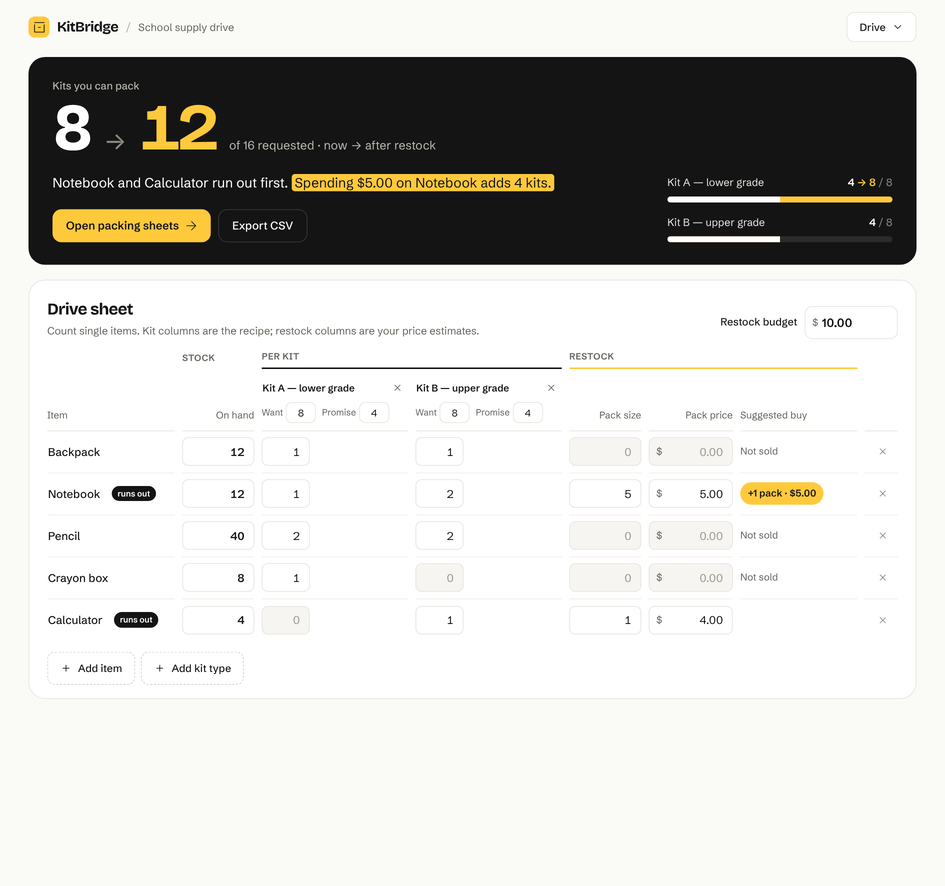
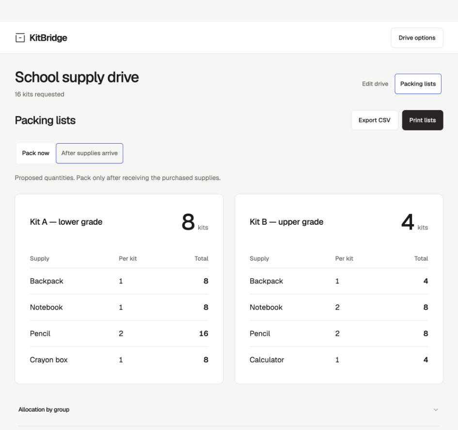
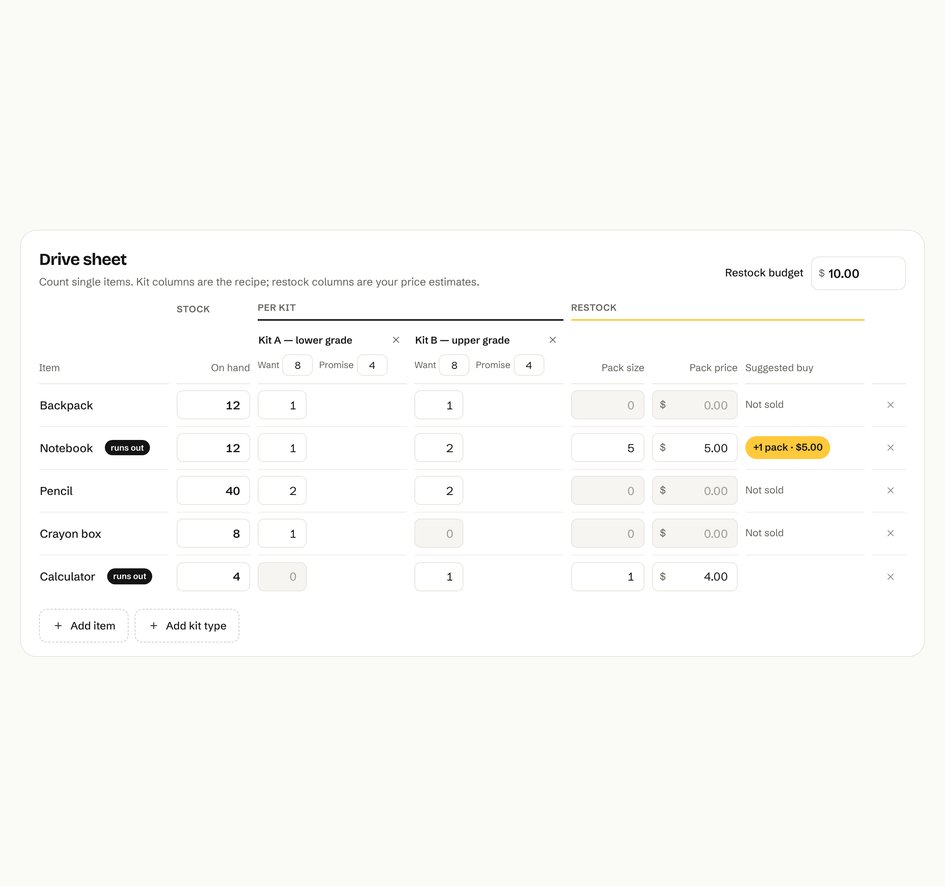

<h1 align="center">KitBridge</h1>

<p align="center">Turn mixed donations into complete school-supply kits.</p>

<p align="center">
  <a href="https://kitbridge-sigma.vercel.app"><strong>Open planner</strong></a>
  &nbsp; / &nbsp;
  <a href="https://kitbridge-sigma.vercel.app/demo/">Watch the film</a>
  &nbsp; / &nbsp;
  <a href="#run-locally">Run locally</a>
</p>

<p align="center">
  
</p>

## From stockroom to packing table

Count your supplies, set a recipe for each kit, and choose how many kits to promise each group. KitBridge works out what you can pack now and what to buy next.

| Count | Plan | Pack |
| :--- | :--- | :--- |
| Track inventory and kit recipes. | Find the smallest purchase bill for the most complete kits. | Print packing sheets or export CSV lists. |

The opening drive packs **8 kits** from stock. A **$5 notebook pack** brings that to **12**. Change the budget, stock or commitments to explore another plan.

<details>
<summary><strong>See the packing sheets and shopping list</strong></summary>
<br />

| Packing sheets | Shopping list |
| :---: | :---: |
|  |  |

</details>

## Made for supply drives

- **Keep commitments.** Set a minimum for each group and see shortages when stock falls short.
- **Spend where it helps.** Compare kits ready now with kits available after restocking.
- **Keep your work.** Drives save on your device; JSON backups let you move them.

All calculations run in the browser. Supports 3 kit types, 12 items, 100 requested kits and a $1,000 restock budget.

## Run locally

Requires **Node.js 22**.

```sh
npm ci
npm run dev
```

| Command | Purpose |
| :--- | :--- |
| `npm test` | Check planning, shortages, exports and saved drives. |
| `npm run build` | Create the production build. |
| `npm run preview` | Preview that build locally. |

React, TypeScript and Vite for the interface; HiGHS in a Web Worker for kit allocation and restock planning.

## License

[MIT](LICENSE). [Font license](public/fonts/LICENSE).
